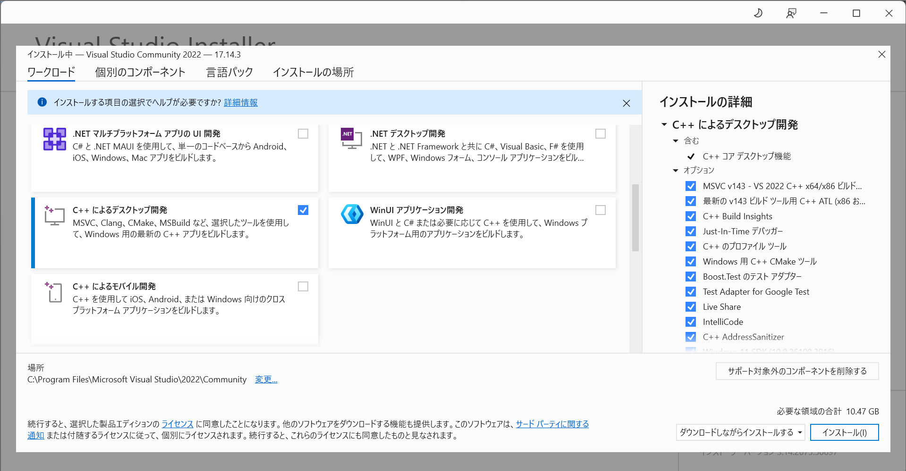
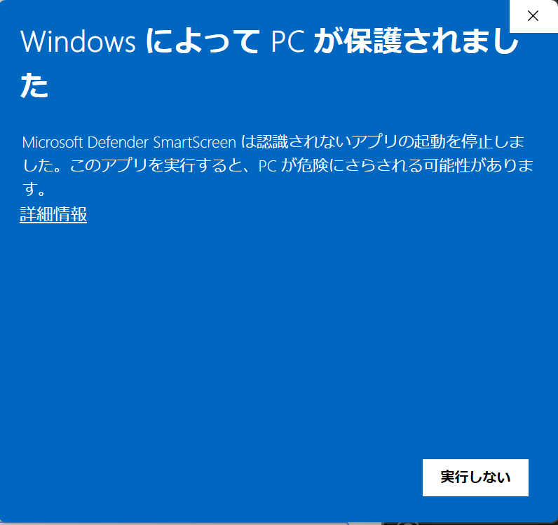
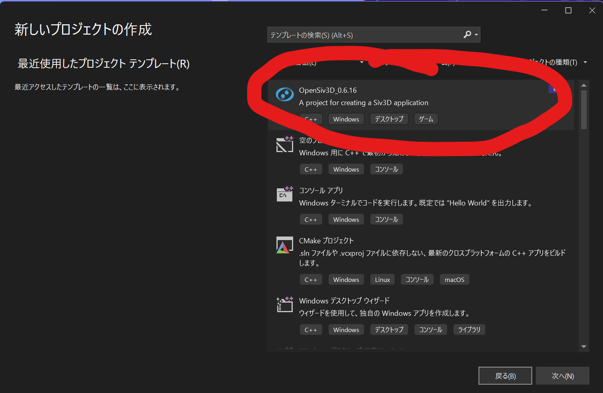

# siv3Dを導入する(Windows編)

まずはsiv3Dをインストールしましょう。

## visual studioを入れる(持っていない人のみ)

* [Visual studioのダウンロードページ](https://visualstudio.microsoft.com/ja/downloads/)からインストーラーをダウンロードし、実行します。

* 「このアプリがPCに変更を加えることを許可しますか？」→はい

* 「C++によるデスクトップ開発」にチェックを入れてインストール(他はお好みで)

* 待ちましょう。結構長いです。

## siv3D本体を入れる

* [このリンクをクリックしてsiv3Dのインストーラーをダウンロードし、実行します。](https://siv3d.jp/downloads/Siv3D/OpenSiv3D_0.6.16_Installer.exe)
するとこのような画面が出てきます。

左下の「詳細情報」をクリックすると「実行」ボタンが出てくるので実行します。

* 大体デフォルトの設定のままでOKなのでそのままインストールします。

* visual studioを起動し、「新しいプロジェクトの作成」からOpenSiv3D_0.6.16をクリックして、適当な名前を決めて作成をクリックします。

以上でsiv3Dが使える環境が整いました。お疲れさまでした。

次回からは様々なコマンドを学習していきます。